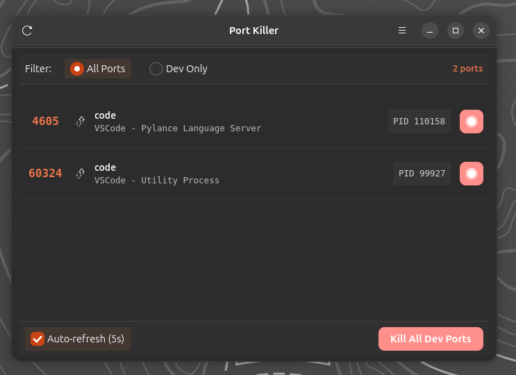
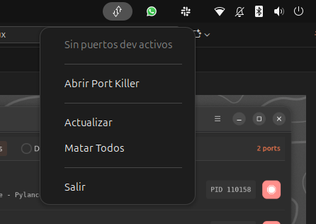
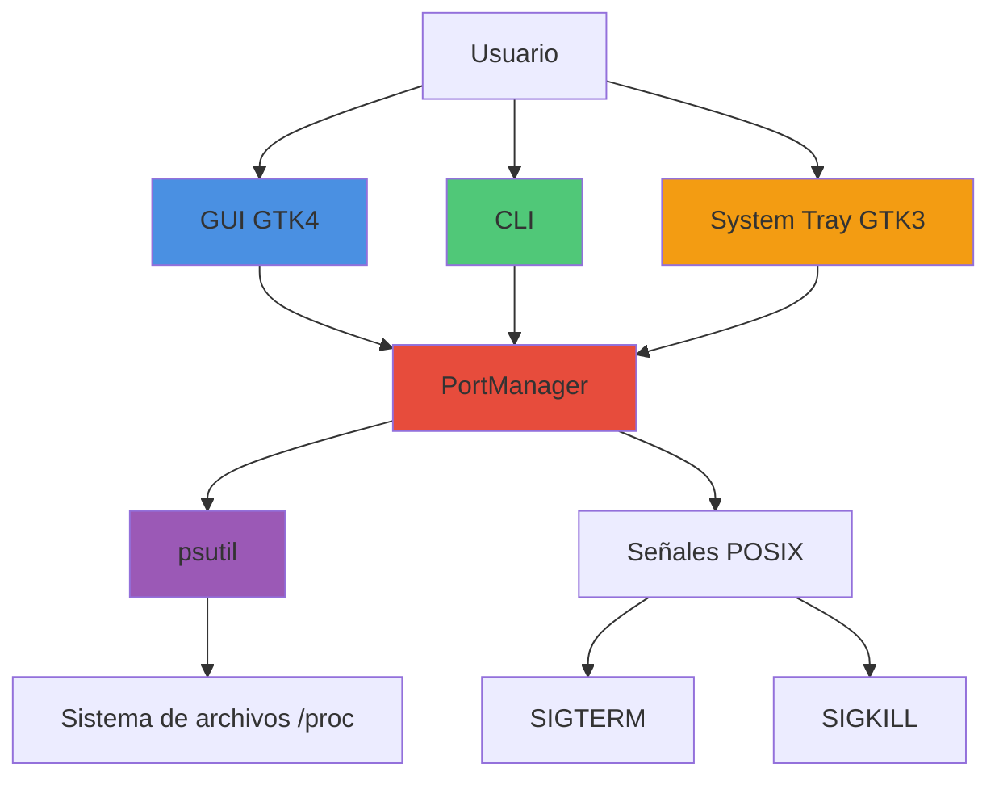
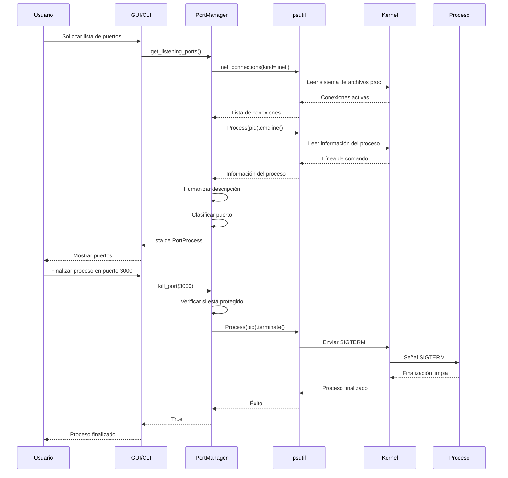
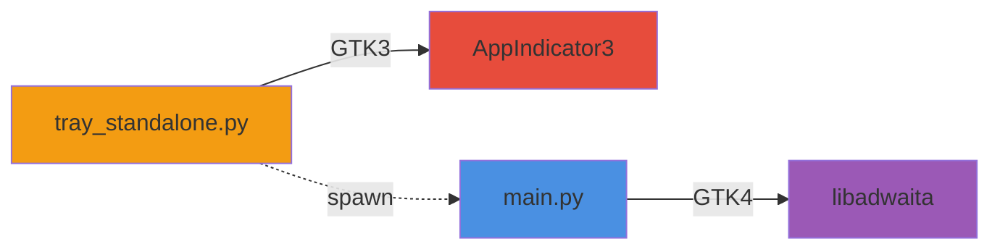

# PORT KILLER

Gestor ligero de puertos para Linux. Permite identificar y finalizar procesos que ocupan puertos de forma rápida y visual, especialmente útil durante el desarrollo de software.





## TABLA DE CONTENIDOS

- [Características](#características)
- [Instalación](#instalación)
- [Uso](#uso)
- [Arquitectura](#arquitectura)
- [Detección Inteligente](#detección-inteligente)
- [Casos de Uso](#casos-de-uso)
- [System Tray](#system-tray)
- [Desarrollo](#desarrollo)
- [Solución de Problemas](#solución-de-problemas)
- [Licencia](#licencia)

## CARACTERÍSTICAS

### INTERFAZ GRÁFICA (GTK4)

- Lista de puertos activos en tiempo real con actualización automática cada 5 segundos
- Filtros configurables: visualizar todos los puertos o solo puertos de desarrollo
- Finalización individual (botón de acción destructiva) o masiva (todos los puertos de desarrollo)
- Etiquetas visuales: `[DEV]` para puertos de desarrollo, `[PROTECTED]` para servicios críticos del sistema
- Línea de comando seleccionable para facilitar la copia
- Descripciones humanizadas de procesos (convierte rutas crípticas como `/proc/self/exe` en nombres descriptivos)
- Confirmación obligatoria para procesos protegidos (bases de datos, servidores web)

### INTERFAZ DE LÍNEA DE COMANDOS (CLI)

- Comandos intuitivos para listar, inspeccionar y finalizar procesos
- Integración con scripts de automatización
- Soporte para operaciones silenciosas (sin confirmación)
- Finalización forzada mediante señal SIGKILL cuando sea necesario

### SYSTEM TRAY

- Indicador permanente en la barra superior del sistema
- Visualización directa de puertos activos desde el menú contextual
- Finalización de procesos con un solo clic
- Actualización automática del estado cada 5 segundos
- Lanzamiento de la interfaz gráfica completa bajo demanda

## INSTALACIÓN

### INSTALACIÓN AUTOMÁTICA

El método recomendado es utilizar el script de instalación automatizado:

```bash
cd port-killer
chmod +x install.sh
./install.sh
```

El instalador realiza las siguientes operaciones:

1. Detecta la distribución Linux (Ubuntu, Debian, Fedora, Arch)
2. Instala dependencias del sistema mediante el gestor de paquetes nativo
3. Instala dependencias de Python (`psutil`, `PyGObject`)
4. Crea un enlace simbólico del CLI en `~/.local/bin/port-killer`
5. Instala la entrada de escritorio para el menú de aplicaciones
6. Habilita la extensión AppIndicator de GNOME Shell (si está disponible)
7. Actualiza las cachés de iconos y aplicaciones del sistema

### INSTALACIÓN MANUAL

Si necesitas instalar manualmente las dependencias:

#### UBUNTU / DEBIAN

```bash
# Dependencias del sistema
sudo apt install \
    python3-gi \
    python3-gi-cairo \
    gir1.2-gtk-4.0 \
    gir1.2-adw-1 \
    gir1.2-appindicator3-0.1 \
    gnome-shell-extension-appindicator

# Dependencias de Python
pip3 install --user psutil PyGObject --break-system-packages
```

#### FEDORA

```bash
# Dependencias del sistema
sudo dnf install \
    python3-gobject \
    gtk4 \
    libadwaita \
    libappindicator-gtk3

# Dependencias de Python
pip3 install --user psutil
```

#### ARCH LINUX

```bash
# Dependencias del sistema
sudo pacman -S \
    python-gobject \
    gtk4 \
    libadwaita \
    libappindicator-gtk3

# Dependencias de Python
pip3 install --user psutil
```

### POST-INSTALACIÓN

Después de instalar, asegúrate de que `~/.local/bin` está en tu `PATH`:

```bash
echo 'export PATH="$HOME/.local/bin:$PATH"' >> ~/.bashrc
source ~/.bashrc
```

Para activar el system tray indicator, cierra sesión y vuelve a entrar, o reinicia GNOME Shell:

```bash
# En GNOME, presiona Alt+F2, escribe 'r' y presiona Enter
```

## USO

### INTERFAZ GRÁFICA

Busca "Port Killer" en tu menú de aplicaciones. La aplicación mostrará una ventana con las siguientes secciones:

1. **Barra de herramientas superior**: Botón de actualización manual y menú de opciones
2. **Filtros**: Selector para visualizar todos los puertos o solo puertos de desarrollo
3. **Lista de puertos**: Cada fila muestra puerto, protocolo, nombre del proceso, comando completo, PID y botón de finalización
4. **Barra de acciones inferior**: Toggle de actualización automática y botón para finalizar todos los puertos de desarrollo

#### FLUJO DE TRABAJO TÍPICO

1. Abre Port Killer desde el menú de aplicaciones
2. Selecciona el filtro "Dev Only" para ver solo puertos de desarrollo
3. Identifica el proceso que ocupa el puerto problemático
4. Haz clic en el botón rojo de finalización junto al proceso
5. Si el proceso está protegido, confirma la acción en el diálogo emergente

### INTERFAZ DE LÍNEA DE COMANDOS

#### LISTAR PUERTOS

```bash
# Listar todos los puertos activos
port-killer list

# Listar solo puertos de desarrollo
port-killer list-dev
```

Salida ejemplo:

```
PORT     PROTOCOL   PID      PROCESS              COMMAND
----------------------------------------------------------------------------------
3000     tcp        12345    node                 node server.js                    [D]
5432     tcp        789      postgres             /usr/lib/postgresql/14/bin/postgres [P]
8080     tcp        45678    java                 java -jar application.jar         [D]

Total: 3 ports
[P] = Protected process
[D] = Development port
```

#### FINALIZAR PROCESOS

```bash
# Finalizar proceso en puerto específico
port-killer kill 3000

# Finalizar con SIGKILL (forzado)
port-killer kill 3000 -f

# Finalizar sin confirmación
port-killer kill 3000 -y

# Finalizar todos los puertos de desarrollo
port-killer kill-dev

# Finalizar todos los puertos de desarrollo sin confirmación
port-killer kill-dev -y
```

#### INSPECCIONAR PUERTO

```bash
# Obtener información detallada de un puerto
port-killer info 5000
```

Salida ejemplo:

```
Port Information:
  Port:         5000
  Protocol:     tcp
  PID:          12345
  Process:      python3
  Command:      python3 -m flask run
  Status:       LISTEN
  Protected:    No
  Dev Port:     Yes
```

## ARQUITECTURA

Port Killer utiliza una arquitectura modular con separación clara de responsabilidades:



### COMPONENTES PRINCIPALES

#### SRC/PORT_MANAGER.PY

Motor principal de detección y gestión de puertos. Responsabilidades:

- Lectura de conexiones de red mediante `psutil.net_connections()`
- Identificación de procesos mediante lectura de `/proc/PID/`
- Humanización de líneas de comando (conversión de rutas crípticas a descripciones legibles)
- Clasificación de puertos (desarrollo vs. sistema)
- Identificación de procesos protegidos (bases de datos, servidores web)
- Envío de señales POSIX para finalización de procesos (SIGTERM, SIGKILL)

#### SRC/MAIN.PY

Aplicación principal GTK4 con libadwaita. Funciones:

- Inicialización de la aplicación Adwaita
- Gestión del ciclo de vida (activación, cierre)
- Carga de estilos CSS personalizados
- Registro de acciones globales (About, Quit)
- Configuración de atajos de teclado

#### SRC/MAIN_WINDOW.PY

Ventana principal de la interfaz gráfica. Características:

- Lista reactiva de puertos con actualización automática
- Sistema de filtrado (todos los puertos / solo desarrollo)
- Diálogos de confirmación para procesos protegidos
- Notificaciones toast para feedback de operaciones
- Gestión de timers para actualización periódica

#### SRC/TRAY_STANDALONE.PY

Indicador de bandeja del sistema ejecutado como proceso independiente. Permite:

- Visualización de puertos activos directamente en el menú
- Finalización de procesos con un clic
- Lanzamiento de la GUI completa
- Actualización automática del estado
- Ejecución en GTK3 separado para evitar conflictos con GTK4

#### SRC/CLI.PY

Interfaz de línea de comandos completa con argparse. Comandos:

- `list`: Listar todos los puertos
- `list-dev`: Listar solo puertos de desarrollo
- `kill PORT`: Finalizar proceso en puerto específico
- `kill-dev`: Finalizar todos los puertos de desarrollo
- `info PORT`: Información detallada de un puerto

### FLUJO DE DATOS



## DETECCIÓN INTELIGENTE

### PUERTOS DE DESARROLLO

Port Killer identifica automáticamente los siguientes rangos como puertos de desarrollo:

| Rango | Tecnologías Típicas |
|-------|-------------------|
| 3000-3999 | Node.js, React (Create React App), Vue CLI, Next.js, Nuxt.js |
| 4200-4299 | Angular CLI |
| 5000-5999 | Flask, Django Dev Server, Laravel Valet |
| 8000-8999 | Django, FastAPI, Go, Phoenix (Elixir) |
| 5173 | Vite Dev Server |
| 8080 | Apache Tomcat, Spring Boot, WEBrick (Ruby) |

### PROCESOS PROTEGIDOS

Los siguientes procesos requieren confirmación explícita antes de ser finalizados, ya que su terminación puede afectar servicios críticos del sistema:

- **Bases de datos**: PostgreSQL, MySQL, MariaDB, MongoDB, Redis, Cassandra
- **Servidores web**: Nginx, Apache HTTP Server
- **Infraestructura**: Docker daemon, systemd

Cuando intentas finalizar un proceso protegido, Port Killer muestra un diálogo de advertencia con el nombre del proceso, el puerto y un botón de confirmación con apariencia destructiva.

### HUMANIZACIÓN DE DESCRIPCIONES

Port Killer convierte rutas de ejecutables y comandos crípticos en descripciones legibles para la comunidad de desarrollo:

| Comando Original | Descripción Humanizada |
|-----------------|----------------------|
| `/proc/self/exe --type=utility` | VSCode - Utility Process |
| `/snap/code/212/usr/share/code/code ...` | VSCode |
| `python3 manage.py runserver` | Django Dev Server |
| `node node_modules/.bin/vite` | Vite Dev Server |
| `node /home/user/.nvm/versions/node/v18.0.0/bin/webpack-dev-server` | Webpack Dev Server |
| `uvicorn main:app --reload` | Uvicorn (FastAPI/Starlette) |
| `gunicorn app:app` | Gunicorn (Python WSGI) |
| `npm run dev` | npm dev script |
| `yarn start` | Yarn start script |
| `pnpm dev` | pnpm dev script |
| `/usr/bin/python3 -m flask run` | Flask Dev Server |
| `node server.js` | Node.js Server |
| `bundle exec rails server` | Ruby on Rails Server |
| `php artisan serve` | Laravel Dev Server |

La humanización se realiza mediante coincidencia de patrones (pattern matching) sobre la línea de comando completa, identificando nombres de ejecutables, argumentos característicos y rutas de gestores de versiones.

## CASOS DE USO

### ERROR "ADDRESS ALREADY IN USE"

Situación muy común durante el desarrollo cuando un servidor de desarrollo no finalizó correctamente:

```bash
$ npm run dev
# Error: EADDRINUSE: address already in use :::3000
# Error: listen EADDRINUSE: address already in use 127.0.0.1:3000
```

Solución con Port Killer:

```bash
$ port-killer kill 3000
Killing process node (PID 12345) on port 3000...
Successfully killed process on port 3000

$ npm run dev
# ✓ El servidor inicia correctamente
```

### LIMPIEZA RÁPIDA AL FINAL DEL DÍA

Cuando finalizas tu jornada de desarrollo y tienes múltiples servidores ejecutándose:

```bash
# Antes (método manual):
$ lsof -i :3000
$ kill 12345
$ lsof -i :5000
$ kill 23456
$ lsof -i :8080
$ kill 34567
# ... repetir para cada puerto

# Con Port Killer:
$ port-killer kill-dev -y
Killed 5 processes
```

### INTEGRACIÓN EN SCRIPTS DE NPM

Asegurar que el puerto esté libre antes de iniciar el servidor de desarrollo:

```json
{
  "name": "mi-proyecto",
  "scripts": {
    "predev": "port-killer kill 3000 -y",
    "dev": "vite",
    "clean": "port-killer kill-dev -y",
    "prestorybook": "port-killer kill 6006 -y",
    "storybook": "storybook dev -p 6006"
  }
}
```

### INTEGRACIÓN EN MAKEFILE

Para proyectos que utilizan Makefiles:

```makefile
.PHONY: dev clean kill-port

dev: kill-port
	npm run dev

kill-port:
	port-killer kill 3000 -y

clean:
	port-killer kill-dev -y
	rm -rf node_modules dist
```

### ALIASES ÚTILES PARA SHELL

Agrega estos alias a tu `~/.bashrc` o `~/.zshrc` para uso frecuente:

```bash
# Aliases de Port Killer
alias kp='port-killer kill'
alias kpd='port-killer kill-dev -y'
alias lp='port-killer list-dev'
alias pk='port-killer'

# Uso:
# kp 3000        - Finalizar puerto 3000
# kpd            - Finalizar todos los puertos de desarrollo
# lp             - Listar puertos de desarrollo activos
```

### DEBUGGING DE CONFLICTOS DE PUERTOS

Cuando necesitas identificar qué proceso está utilizando un puerto específico:

```bash
$ port-killer info 5432

Port Information:
  Port:         5432
  Protocol:     tcp
  PID:          1234
  Process:      postgres
  Command:      /usr/lib/postgresql/14/bin/postgres -D /var/lib/postgresql/14/main
  Status:       LISTEN
  Protected:    Yes
  Dev Port:     No

# Ahora sabes exactamente qué está ejecutándose en ese puerto
```

### CAMBIO RÁPIDO ENTRE VERSIONES DE SERVIDORES

Cuando necesitas cambiar entre diferentes versiones de un servidor de desarrollo:

```bash
# Finalizar servidor React antiguo
$ port-killer kill 3000 -y

# Iniciar nueva versión
$ cd nuevo-proyecto
$ npm run dev
```

## SYSTEM TRAY

El system tray indicator proporciona acceso rápido sin necesidad de abrir la interfaz gráfica completa.

### ACTIVACIÓN

Después de ejecutar `./install.sh`, el system tray se activa automáticamente:

1. Cierra sesión y vuelve a entrar, o reinicia GNOME Shell (Alt+F2 → `r` → Enter)
2. Busca "Port Killer" en tu menú de aplicaciones
3. Ejecuta la aplicación
4. Aparecerá un icono de red (flechas arriba/abajo) en la barra superior
5. Haz clic en el icono para ver el menú contextual

### MENÚ CONTEXTUAL

El menú del system tray muestra:

```
═══ N Puertos Activos ═══
────────────────────────
3000 - node              ← Clic para finalizar
5000 - python3           ← Clic para finalizar
8080 - java              ← Clic para finalizar
────────────────────────
Abrir Port Killer        ← Abre GUI completa
────────────────────────
Actualizar               ← Refrescar lista
Matar Todos              ← Finalizar todos los dev ports
────────────────────────
Salir                    ← Cerrar tray
```

### ACTUALIZACIÓN AUTOMÁTICA

El menú se actualiza automáticamente cada 5 segundos, mostrando siempre el estado actual de los puertos de desarrollo activos.

### ARQUITECTURA DEL TRAY

El system tray se ejecuta como un proceso independiente utilizando GTK3 + AppIndicator3, separado de la aplicación principal (GTK4). Esto evita conflictos de versiones de GTK:



Ambos procesos pueden ejecutarse simultáneamente sin interferencia.

## DESARROLLO

### EJECUTAR DESDE CÓDIGO FUENTE

Sin necesidad de instalar:

```bash
# Interfaz gráfica
python3 src/main.py

# System tray
python3 src/tray_standalone.py &

# CLI
python3 src/cli.py list
python3 src/cli.py kill 3000
```

### ESTRUCTURA DEL PROYECTO

```
port-killer/
├── src/
│   ├── port_manager.py      # Motor de detección y gestión de puertos
│   ├── main.py              # Aplicación GTK4 principal
│   ├── main_window.py       # Ventana principal con lista de puertos
│   ├── tray_standalone.py   # System tray (proceso separado GTK3)
│   └── cli.py               # Interfaz de línea de comandos
├── assets/
│   └── style.css            # Estilos CSS para GTK4
├── install.sh               # Script de instalación automatizado
├── uninstall.sh             # Script de desinstalación
├── requirements.txt         # Dependencias de Python
└── README.md                # Este archivo
```

### DEPENDENCIAS DE DESARROLLO

Para contribuir al proyecto necesitas:

```bash
# Dependencias de runtime
pip3 install psutil PyGObject

# Dependencias de desarrollo (opcionales)
pip3 install pytest black flake8 mypy
```

### TESTING

Actualmente Port Killer no cuenta con suite de tests automatizados. Esta es un área donde las contribuciones son especialmente bienvenidas.

Para testing manual:

```bash
# Levantar servidores de prueba en varios puertos
python3 -m http.server 3000 &
python3 -m http.server 5000 &
python3 -m http.server 8080 &

# Verificar que Port Killer los detecta
port-killer list-dev

# Finalizar todos
port-killer kill-dev -y
```

### ESTÁNDARES DE CÓDIGO

El proyecto sigue las siguientes convenciones:

- **PEP 8**: Estilo de código Python
- **Type hints**: Anotaciones de tipo donde sea apropiado
- **Docstrings**: Documentación completa en español para todas las clases y funciones públicas
- **Comentarios**: Explicaciones detalladas para lógica compleja
- **Castellano neutro**: Documentación accesible para toda la comunidad hispanohablante

### CONTRIBUIR

Las contribuciones son bienvenidas. Áreas prioritarias:

1. **Suite de tests**: Implementar pytest con cobertura completa
2. **Soporte multiplataforma**: Adaptar para otras distribuciones Linux
3. **Internacionalización**: Sistema i18n para múltiples idiomas
4. **Documentación**: Tutoriales, ejemplos de uso, screencasts
5. **Optimización**: Mejorar rendimiento de detección de puertos
6. **Características**: Exportación de reportes, historial de puertos, estadísticas de uso

Proceso de contribución:

1. Fork del repositorio
2. Crea una rama para tu feature (`git checkout -b feature/nueva-caracteristica`)
3. Realiza commits con mensajes descriptivos
4. Asegúrate de que el código sigue los estándares del proyecto
5. Abre un Pull Request con descripción detallada de los cambios

## SOLUCIÓN DE PROBLEMAS

### COMMAND NOT FOUND: PORT-KILLER

El directorio `~/.local/bin` no está en tu `PATH`.

**Solución:**

```bash
# Verificar si ~/.local/bin está en PATH
echo $PATH | grep -q "$HOME/.local/bin" && echo "En PATH" || echo "No en PATH"

# Agregar a ~/.bashrc
echo 'export PATH="$HOME/.local/bin:$PATH"' >> ~/.bashrc
source ~/.bashrc

# O para zsh
echo 'export PATH="$HOME/.local/bin:$PATH"' >> ~/.zshrc
source ~/.zshrc
```

### LA INTERFAZ GRÁFICA NO ABRE

GTK4 o libadwaita no están instalados correctamente.

**Diagnóstico:**

```bash
# Verificar GTK4
python3 -c "import gi; gi.require_version('Gtk', '4.0'); from gi.repository import Gtk; print('GTK4 instalado correctamente')"

# Verificar libadwaita
python3 -c "import gi; gi.require_version('Adw', '1'); from gi.repository import Adw; print('libadwaita instalado correctamente')"
```

**Solución:**

```bash
# Ubuntu/Debian
sudo apt install gir1.2-gtk-4.0 gir1.2-adw-1

# Fedora
sudo dnf install gtk4 libadwaita

# Arch
sudo pacman -S gtk4 libadwaita
```

### PERMISSION DENIED AL FINALIZAR PROCESO

Intentas finalizar un proceso que pertenece a otro usuario o al sistema.

**Explicación:**

Port Killer solo puede finalizar procesos que pertenecen a tu usuario. Los procesos del sistema o de otros usuarios requieren privilegios elevados.

**Solución:**

```bash
# Opción 1: Ejecutar con sudo (no recomendado para uso general)
sudo port-killer kill 80

# Opción 2: Verificar el propietario del proceso
port-killer info 80
# Si el proceso pertenece a root, necesitarás sudo
```

### EL ICONO DEL SYSTEM TRAY NO APARECE

La extensión AppIndicator no está habilitada o las cachés no están actualizadas.

**Diagnóstico:**

```bash
# Verificar extensiones de GNOME Shell
gnome-extensions list | grep -i indicator
```

**Solución:**

```bash
# Habilitar extensión AppIndicator
gnome-extensions enable ubuntu-appindicators@ubuntu.com
# o
gnome-extensions enable appindicatorsupport@rgcjonas.gmail.com

# Actualizar cachés
gtk-update-icon-cache ~/.local/share/icons/hicolor/
update-desktop-database ~/.local/share/applications

# Reiniciar GNOME Shell
# Presiona Alt+F2, escribe 'r', presiona Enter
# O cierra sesión y vuelve a entrar
```

### ERROR: EXTERNALLY-MANAGED-ENVIRONMENT

Ubuntu 23.04+ y Debian 12+ previenen instalación de paquetes Python con pip por defecto (PEP 668).

**Explicación:**

Las distribuciones modernas protegen el Python del sistema para evitar conflictos con el gestor de paquetes.

**Solución:**

```bash
# Opción 1: Usar flag --break-system-packages (usado en install.sh)
pip3 install --user psutil PyGObject --break-system-packages

# Opción 2: Usar entorno virtual (recomendado para desarrollo)
python3 -m venv venv
source venv/bin/activate
pip install psutil PyGObject
```

### NO SE DETECTAN ALGUNOS PUERTOS

Puertos en rangos no estándar no son clasificados como puertos de desarrollo.

**Explicación:**

Port Killer clasifica puertos según rangos predefinidos. Puertos personalizados (ej: 9000, 7777) se mostrarán en "All Ports" pero no en "Dev Only".

**Solución temporal:**

Usa el filtro "All Ports" para visualizar todos los puertos del sistema.

**Contribución bienvenida:**

Implementar configuración personalizada de rangos de puertos de desarrollo.

### LA APLICACIÓN CONSUME DEMASIADOS RECURSOS

El auto-refresh con intervalo muy corto puede consumir CPU.

**Solución:**

Deshabilita el auto-refresh desde la interfaz gráfica (checkbox en la barra inferior) cuando no lo necesites. El refresh manual sigue disponible con el botón del header.

## ESTADÍSTICAS DE PRODUCTIVIDAD

Análisis de tiempo ahorrado en un escenario típico de desarrollo con múltiples servicios:

### MÉTODO MANUAL (SIN PORT KILLER)

```bash
# 1. Identificar proceso
lsof -i :3000                    # 10 segundos
# 2. Leer PID
                                 # 5 segundos
# 3. Ejecutar kill
kill 12345                       # 5 segundos
# 4. Verificar si finalizó
lsof -i :3000                    # 10 segundos
# 5. Kill forzado si es necesario
kill -9 12345                    # 5 segundos
# 6. Verificar nuevamente
lsof -i :3000                    # 10 segundos

# Tiempo total: 45-60 segundos por puerto
```

### CON PORT KILLER

```bash
port-killer kill 3000 -y         # 2-3 segundos

# Tiempo total: 2-3 segundos
```

### CÁLCULO DE AHORRO ANUAL

Supuestos:
- **Conflictos de puerto por día**: 4 (conservador)
- **Días laborables por año**: 250
- **Tiempo manual por conflicto**: 60 segundos
- **Tiempo con Port Killer**: 3 segundos

```
Tiempo manual anual:
  4 conflictos/día × 250 días × 60 seg = 60,000 segundos = 16.67 horas

Tiempo con Port Killer anual:
  4 conflictos/día × 250 días × 3 seg = 3,000 segundos = 0.83 horas

Ahorro anual:
  16.67 - 0.83 = 15.84 horas ≈ 2 días laborables completos
```

**Port Killer te ahorra aproximadamente 2 días de trabajo al año**, sin contar:
- Reducción de frustración por errores recurrentes
- Menor interrupción del flujo de desarrollo
- Menor probabilidad de errores al copiar PIDs incorrectos

## TECNOLOGÍAS

### STACK TECNOLÓGICO

- **Python 3.10+**: Lenguaje de programación principal
- **GTK4**: Framework de interfaz gráfica moderno
- **libadwaita**: Biblioteca de componentes para GNOME
- **psutil**: Detección de procesos y conexiones de red multiplataforma
- **AppIndicator3**: System tray para entornos de escritorio Linux
- **PyGObject**: Bindings de Python para GObject Introspection

### JUSTIFICACIÓN DE ELECCIONES

#### POR QUÉ GTK4 Y NO GTK3

- API moderna y limpia
- Mejor rendimiento de renderizado
- Soporte para aceleración por hardware
- Integración nativa con libadwaita para apariencia GNOME moderna
- Ciclo de vida activo con actualizaciones regulares

#### POR QUÉ PYTHON Y NO RUST/C++

- Prototipado rápido
- Bindings de PyGObject maduros y estables
- Acceso directo a psutil para detección de procesos multiplataforma
- Mayor accesibilidad para contribuidores
- Rendimiento suficiente para esta aplicación (no requiere optimización extrema)

#### POR QUÉ PROCESO SEPARADO PARA SYSTEM TRAY

GTK4 y GTK3 no pueden coexistir en el mismo proceso Python. AppIndicator3 requiere GTK3, mientras que la aplicación principal usa GTK4. La solución arquitectónica es ejecutar el system tray como proceso independiente.

## LIMITACIONES CONOCIDAS

1. **Solo Linux**: Port Killer está diseñado específicamente para sistemas Linux. No es compatible con Windows o macOS.
2. **Requiere permisos de usuario**: Solo puede finalizar procesos del usuario actual (sin sudo).
3. **Dependencia de psutil**: La detección de procesos depende de las capacidades de psutil en cada sistema.
4. **Sin tests automatizados**: El proyecto actualmente no cuenta con suite de pruebas (contribuciones bienvenidas).

## SEGURIDAD

### CONSIDERACIONES DE SEGURIDAD

- Port Killer **NO** requiere permisos de root para operación normal
- Solo puede finalizar procesos que pertenecen al usuario que lo ejecuta
- Los procesos protegidos requieren confirmación explícita
- No almacena credenciales ni información sensible
- No realiza conexiones de red (todo es local)

### AUDITORÍA DE CÓDIGO

El código fuente está completamente abierto y documentado. Cada función incluye docstrings detallados explicando su propósito. Puedes auditar el código revisando:

- `src/port_manager.py`: Lógica de detección y finalización
- `src/cli.py`: Interfaz de línea de comandos
- `src/main.py` y `src/main_window.py`: Interfaz gráfica

## LICENCIA

MIT License

Copyright (c) 2025 686f6c61

Se concede permiso, de forma gratuita, a cualquier persona que obtenga una copia de este software y archivos de documentación asociados (el "Software"), para utilizar el Software sin restricciones, incluyendo sin limitación los derechos de usar, copiar, modificar, fusionar, publicar, distribuir, sublicenciar y/o vender copias del Software, y permitir a las personas a las que se les proporcione el Software hacer lo mismo, sujeto a las siguientes condiciones:

El aviso de copyright anterior y este aviso de permiso se incluirán en todas las copias o porciones sustanciales del Software.

EL SOFTWARE SE PROPORCIONA "TAL CUAL", SIN GARANTÍA DE NINGÚN TIPO, EXPRESA O IMPLÍCITA, INCLUYENDO PERO NO LIMITADO A LAS GARANTÍAS DE COMERCIABILIDAD, IDONEIDAD PARA UN PROPÓSITO PARTICULAR Y NO INFRACCIÓN. EN NINGÚN CASO LOS AUTORES O TITULARES DEL COPYRIGHT SERÁN RESPONSABLES DE NINGUNA RECLAMACIÓN, DAÑO U OTRA RESPONSABILIDAD, YA SEA EN UNA ACCIÓN DE CONTRATO, AGRAVIO O DE OTRO MODO, DERIVADA DE, FUERA DE O EN CONEXIÓN CON EL SOFTWARE O EL USO U OTROS TRATOS EN EL SOFTWARE.

## ENLACES

- **Repositorio**: https://github.com/686f6c61/linux-port-killer
- **Issues**: https://github.com/686f6c61/linux-port-killer/issues
- **Autor**: 686f6c61

---

**Versión**: 1.0.0
**Estado**: Producción
**Última actualización**: 17 de enero de 2025
